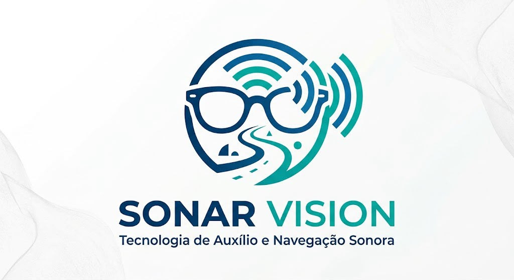

<p align="center">
  
</p>

# Sonar Vision

> Tecnologia de Auxílio e Navegação Sonora

[](#estado-atual)
[](LICENSE)

Sistema vestível experimental de navegação assistiva para pessoas com
deficiência visual. O projeto combina sensores de profundidade, orientação
espacial, visão computacional, feedback tátil e processamento remoto para
investigar formas de comunicar obstáculos e situações dinâmicas.

> [!WARNING]
> Este projeto está em estágio inicial de pesquisa e desenvolvimento. Ainda não
> existe um protótipo vestível completo ou validado para uso cotidiano. O Sonar
> Vision não é um dispositivo médico e não substitui bengala, cão-guia,
> treinamento de orientação e mobilidade ou orientação profissional.

## Estado atual

Em setembro de 2026, o repositório contém a arquitetura inicial, decisões
técnicas, planejamento experimental e o primeiro módulo de detecção/tracking
com estado isolado por sessão. Há testes sem hardware e benchmark local;
firmware, hardware e API/serviços de nuvem ainda não estão integrados.

As tecnologias, componentes e parâmetros descritos são hipóteses iniciais e
podem mudar conforme benchmarks, testes de bancada e decisões registradas pelo
grupo.

- [Acompanhar o Kanban](https://github.com/users/BryanPinheiro77/projects/3)
- [Consultar as issues](https://github.com/BryanPinheiro77/sonar-vision/issues)
- [Ver os primeiros passos](docs/PRIMEIROS_PASSOS.md)
- [Consultar o escopo da entrega acadêmica](docs/ESCOPO.md)
- [Entender como contribuir](CONTRIBUTING.md)

## Objetivo

O Sonar Vision busca auxiliar a percepção de obstáculos e situações dinâmicas,
combinando geometria e contexto semântico para investigar funções como:

- indicar obstáculos à esquerda, ao centro ou à direita;
- identificar riscos na altura da cabeça e possíveis desníveis;
- estimar aproximação e tempo até colisão (TTC);
- reconhecer diferentes categorias de objetos relevantes;
- distinguir um alvo convergente de outro que apenas cruza o campo de visão;
- comunicar urgência e direção por vibração;
- complementar o alerta tátil com mensagens de áudio não repetitivas.

## Princípio de segurança

O alerta imediato de proximidade deverá funcionar **localmente no ESP32-S3**.
Nenhuma função crítica de segurança pode depender exclusivamente de internet,
VM, câmera ou inferência probabilística.

A visão computacional acrescenta semântica e contexto, mas não substitui a
percepção geométrica local. Se a conexão ou a VM falhar, o dispositivo deverá
continuar operando em modo tátil.

```text
Sensores + ESP32-S3                    Nuvem / VM
┌─────────────────────┐   Wi-Fi   ┌─────────────────────────┐
│ ToF + IMU           │ ────────► │ detecção + tracking     │
│ risco + TTC local   │           │ trajetória + semântica  │
│ feedback háptico    │ ◄──────── │ resultados e telemetria │
└─────────────────────┘           └─────────────────────────┘
          │
          └── permanece funcional sem a VM
```

Veja a [arquitetura detalhada](docs/ARCHITECTURE.md) e a
[decisão cloud-first](docs/decisions/0001-cloud-first.md).

## Componentes e stack previstos

| Área | Baseline inicial |
|---|---|
| Microcontrolador | ESP32-S3-WROOM-1 N16R8 |
| Profundidade | VL53L5CX ToF 8×8 |
| Orientação | BNO085 IMU 9-DOF |
| Câmera | OV2640 |
| Feedback tátil | DRV2605L e dois atuadores LRA |
| Áudio | MAX98357A e transdutor de condução óssea |
| Firmware | Arduino-ESP32, PlatformIO, FreeRTOS e C++17 |
| Visão computacional | Python, OpenCV, YOLO e ByteTrack |
| Serviços | FastAPI, MQTT e HTTP/TCP |

Essa baseline ainda será validada. Banco de dados, provedor de nuvem e
eventual hardware Edge permanecem em avaliação; Edge não faz parte do MVP.

## Desenvolvimento

O [guia consolidado de execução](docs/execution.md) reúne instalação, comandos
dos módulos e verificação offline. O [roteiro demonstrativo](docs/demo.md)
distingue dados sintéticos, análise real e hardware, com pendências explícitas.

O [guia do módulo de visão](docs/vision.md) contém instalação, interface para
a API, testes sem câmera e benchmark local. Ainda não há comando de execução
do sistema integrado completo.

O [guia de CI e marcos de software](docs/ci.md) descreve os testes automáticos
dos PRs e a publicação manual de versões experimentais por tag.

O trabalho é organizado em entregas pequenas por issues e pelo Kanban:

```text
Backlog → A fazer → Em andamento → Em revisão → Concluído
```

O roadmap completo e as métricas planejadas estão em:

- [Roadmap](docs/ROADMAP.md)
- [Experimentos e métricas](docs/experiments/README.md)
- [Decisões de arquitetura](docs/decisions/README.md)
- [Changelog](CHANGELOG.md)

## Privacidade e ética

Não devem ser versionados vídeos de participantes, datasets brutos, dados
pessoais, credenciais ou pesos grandes de modelos. Testes formais com pessoas
exigem consentimento, supervisão e verificação das exigências éticas da
instituição.

Falhas de segurança devem seguir a [política de segurança](SECURITY.md), sem a
publicação de informações sensíveis em issues abertas.

## Contribuição

Contribuições são bem-vindas. Antes de começar:

1. leia o [guia de contribuição](CONTRIBUTING.md);
2. escolha uma issue com objetivo e critérios de aceitação;
3. discuta mudanças de arquitetura antes de implementá-las;
4. siga o [Código de Conduta](CODE_OF_CONDUCT.md).

Contribuições aceitas são disponibilizadas sob a mesma licença do projeto.

## Contexto acadêmico

O Sonar Vision é desenvolvido como Projeto Integrador do curso de Análise e
Desenvolvimento de Sistemas — Senac. O projeto explora IoT, sistemas
embarcados, visão computacional, fusão sensorial, sistemas distribuídos e
tecnologia assistiva.

## Licença

O software e a documentação deste repositório são distribuídos sob a
[GNU Affero General Public License v3.0](LICENSE), identificador SPDX
`AGPL-3.0-only`.

Artefatos futuros de hardware, datasets, vídeos e pesos de modelos poderão ter
licenças próprias, declaradas nos respectivos diretórios. Dependências de
terceiros permanecem sujeitas às licenças de seus autores.
